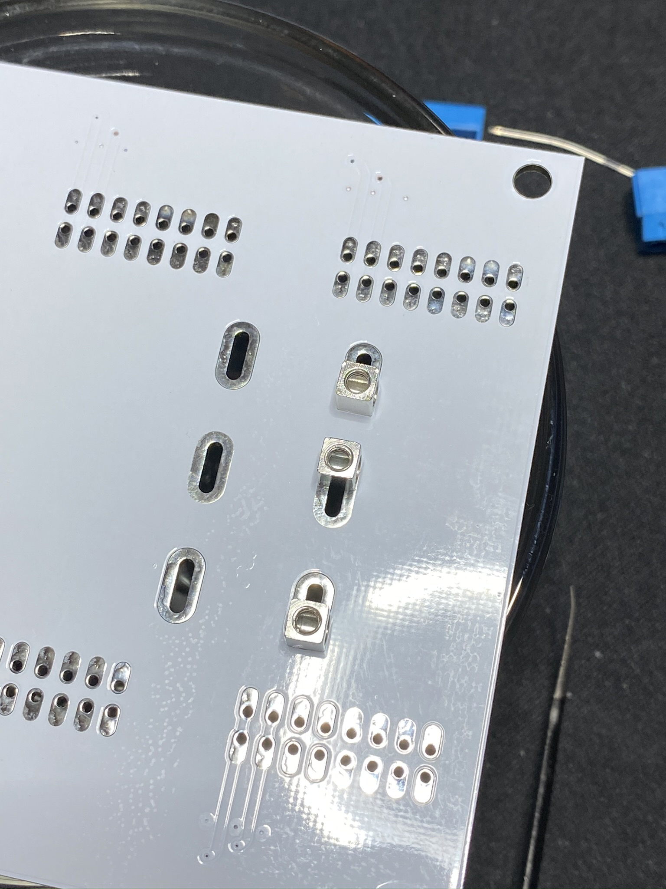

# Metatronic Bus Board

## Abstract
Assembly of Metatronic Mod's economical bus board.

## Bill of Materials
- PCB Screw Terminal/Block Connector, 5mm Pitch, 2pin.
    * Manufactured by KeeYees, purchased from [Amazon](https://www.amazon.com/gp/product/B07H5G7GC6/ref=ppx_yo_dt_b_asin_title_o04_s01?ie=UTF8&psc=1).
- 12AWG, Solid Core Copper Wire
    * Can be sourced from local Hardware Stores; ex. Home Depot, Lowes.
- IDC 16pin Header
    * This the "shrouded" Eurorack power header. 
- Metatronic Mods Bus Board PCB.

## Part Prep

The screw terminals need to be dissembled. The item linked to Amazon is a bag of 60 pcs; 10x 3pin and 50x 2pin.

For whatever reason, manufacturing, etc.; the 3pin part dissembles very easily. Simply unscrew the screw till it drops out of the housing. Then you can push the metal terminal and the leaf spring out of the plastic housing. 

**Note:** The 2pin counterparts do not dissemble easily. Upon completely unscrewing the screw, it does not fall out. Moreso, the screw still remains fully encloused in the plastic housing. Unfortunately, the plastic housing needs to be cut apart using a knife. It is only then that the screw can be dislodged, and the metal terminal & leaf spring can be removed.

*Author's Note:* I personally think that the 2pin screw headers sourced in this grab bag from Amazon might be the "more official" or better copied part. Therefore, should one source these sorts of parts from a more reputable vendor, you may have to simply cut apart the plastic housing to full dissemble. It is clear more research diving around the parts bin is needed.

Ultimately, this procedure serves to source the small metal terminals.

**EDIT/UPDATE:** The 2pin terminals can be non-destructively dissembled. Insert a small set of tweesers under the leaf spring. Apply pressure in the direction normal to the metal housing; basically attempt to pull the leaf spring out. Unscrew the screw; you should feel additional friction on the screw. The screw should completely dislodge itself and one can remove the internal metal terminal.

The screws here are tapered on the very last few threads. This allows the user to completely unscrew the screw without the screw dislodging. It makes sense as this is desired behavior during the normal operation of the screw terminal. Applying the force onto the leaf spring as directed forces the leaf spring to always thread against the screw, especially during the final threads; this allows the screw to dislodge itself.

## Assembly

This phase isn't very complicated. The images will provide most of the instruction. On the right side of the board, insert screw housings as shown in the following image.

Once these are soldered in, create a straight line of housings using the 12awg bare copper wire as a guide. **DO NOT SOLDER/INSTALL THE COPPER WIRE!** This is shown below:

After completing a nice, straight row, continue on and install the following rows. You should end up with a board with a bottom similar to this:

Next is to assemble the power inlets for the bus board. Arrange 3 2-pin housings, with the metal housings removed to match the following image.

The odd arrangement allows this to be install in the same slot holes on the top side.

Carefully solder the inlet in. Avoid sinking heat into the board during this install; doing so will cause issues with the solder joints for the already installed metal housings. Work quickly and allow time for the heat to dissapate between joints.

With the power inlet installed, you can install the 12awg bare copper wires to link the circuits. Solder works, but you may opt for screwing in place with the metal housings; a M2.5 set screw would be ideal for my specific part. 

Soldering the copper wire has its own challenges. First, the entire wire works as a heatsink, forcing you to dump plenty of heat into it to get the surfaces to solder temp; be careful! Also, thermal expansion of the wire will be an issue; take breaks to allow the wire to cool between each solder joint. Consequetly, quick work here will greatly heat the wire, and upon cooling, it will contract and distort the PCB causing very significant bowing. Avoid this! Work slowly!

## Conclusions
WIth the wires installed, you may install the wire connections you plan to use in your system. Also, you can install the 3-pin +5V/CV/Gate Inlet if your system utilizes those circuits. 

**A continunity check here is highly advised!**

All that's left is to install the Bus Board into your enclosure, hook everything up and power it on. Enjoy!